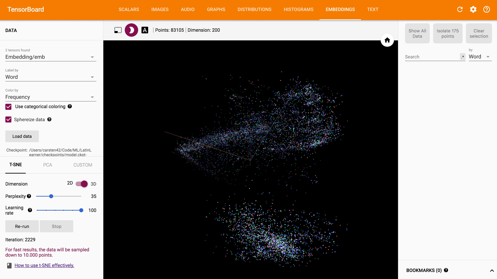
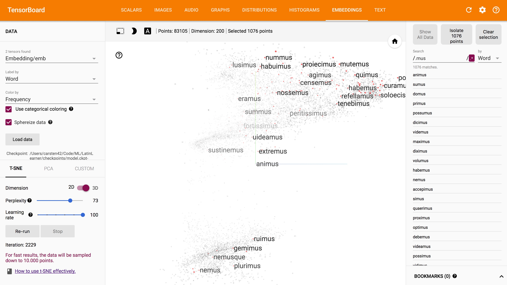
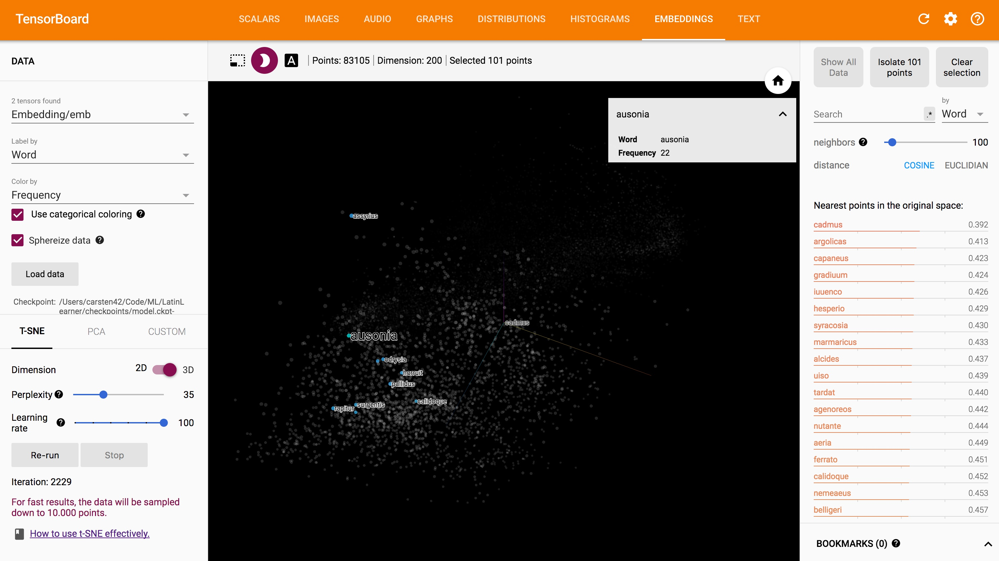

# LatinLearner

Deep Learning project for the Latin Language with the goal to build a Latin Chatbot and improve the understanding of the Latin language.

## Purpose

This project has mainly educational purposes.
1. Learn the technologies required to build a deep learning system that can process Latin Language
2. Practice coding skills, github, testing etc.
3. Provide the Latin language model as a tool for use in school or university or on a website / app / etc.

## Data

To build a useful language model it is essential to have enough high quality input data about the specific language.

There are several sources for latin text on the internet.

* The [Latin Library](http://thelatinlibrary.com/index.html)
* [Perseus Database](http://www.perseus.tufts.edu/hopper/opensource/download)
* Many more

As I wanted to learn something on data collection and scraping, I developed the script [`scrape_latin_texts.py`](scrape_latin_texts.py) to download the data from the Latin Library and store those as text files. From the Perseus Database you can directly download a collection of latin and greek texts with English Translations. However, extensive postprocessing is required here which is adressed in the next section.

All the data will be stored in a directory called 'library' which you have to **generate with the scraping script before running the cleaning script**.

The final data I worked with contained about 690 Latin texts with an overall size of around 24MB.


## Data Cleaning and Processing

The data from the scraping tool contains a lot of information that we don't want to have the neural network to learn or output to the user. Therefore, it is essential to clean this data. This is done by running the script [`clean_data.py`](clean_data.py).

The script can identify duplicates which might have been downloaded in several attempts of doing the scraping.
See the documentation of the function `find_duplicates` for details.

Additionally, the code will also remove certain parts of the files like arabic numbers which are used for marking paragraphs are information in square brackets or the references to the Latin Library at the end.

The output can then directly be used for processing with the [LSTM model](LSTM_model.py).

To make the text usable for the embeddings, you also need to remove all punctuation, which can be done by including a call to the respective function in the cleaning script.
Additionally, you need to concatenate all the small files into one large file by using `cat clean_library/*.txt > latin_texts.txt`.


## Models

### Char RNN
Based on the [Udacity AI Nanodegree Anna KaRNNa jupyter notebook](https://github.com/udacity/deep-learning/tree/master/intro-to-rnns) for text generation, I adopted the code to generate Latin text and put it into a [seperate Python file](LSTM_model.py). The code is also available in the [notebook](LatinLeaRNNr.ipynb). There is also a pretrained model available in the directory `models` which has been trained for several hours on a K80 GPU on AWS. Using the command line options in `latin_learner.py` you can either just load the model and generate text, continue training based on the existing model, or start training from scratch when you want to experience with the model.

### Embeddings

Based on the Tensorflow word2vec tutorial (see references), you can build an embedding space for Latin based on the texts from famous authors like Caesr, Cicero etc.

As mentioned in the tutorials page you need to compile the ops as follows:

```shell
TF_INC=$(python -c 'import tensorflow as tf; print(tf.sysconfig.get_include())')
g++ -std=c++11 -shared word2vec_ops.cc word2vec_kernels.cc -o word2vec_ops.so -fPIC -I $TF_INC -O2 -D_GLIBCXX_USE_CXX11_ABI=0
```

On Mac, add `-undefined dynamic_lookup` to the g++ command.

(For an explanation of what this is doing, see the tutorial on [Adding a New Op to TensorFlow](https://www.tensorflow.org/how_tos/adding_an_op/#building_the_op_library). The flag `-D_GLIBCXX_USE_CXX11_ABI=0` is included to support newer versions of gcc. However, if you compiled TensorFlow from source using gcc 5 or later, you may need to exclude the flag.)
Then run using:

```shell
python word2vec.py \
  --train_data=latin_texts.txt \
  --eval_data=latin_questions.txt \
  --save_path=logs/
```

If you want to restore the latest pretrained embedding model and experiment with an interactive Python session on the data, you should add the following arguments:

```
--training=False --checkpoint=latest
```

The embedding model of the Latin Language with Keras in the [embedding.py](embedding.py) file is based on the model from the Keras word2vec tutorial mentioned in the references. The results are not really convincing. 
I just wanted to experiment with the Keras version integrated into TensorFlow. It seems that not many people are actually using this. 


## Chatbot

Usually, you would need some kind of question answer pairs to build a chatbot. As this is not available for Latin, I used the Char RNN and primed it with the input text and then let it generate output text based on the respective input text.

## Results

### Char RNN

I did some experiments with different types of models which are documented here:

1. Based on other projects I have done, I selected a 2 layer LSTM model with 512 nodes each, the BasicLSTM Cell was used and Dropout trained on the small_library with 10 epochs.
2. Same network as model 1, but the BasicLSTMCell was replaced with a LayerNormBasicLSTMCell already including dropout. The general recommendation is to use batch or layer normalization, especially for RNNs. In Keras this can be achieved easily. In Tensorflow this was the best solution I could find.
3. As the experiments with the small_library were promising, I tansfered the model now to AWS and trained on the whole dataset in the clean_library and trained 61% of the first epoch. I stopped there to have a short evaluation of this model.
4. Now I trained the model from point 3 for 5 epochs which took several hours. I stopped the training training and validation loss saturated.  

I did not experiment with larger models as I think the size of the input data is not enough to justify much longer training and much larger models. There seems to be no overfitting and other enhancements would probably be more beneficial than larger networks. Additionally, it is quite difficult to judge the real quality of the generated text and there must be a detailed evaluation on how to make good use of it. For the larger models, there is no test loss, as this is generated at the end of the training and I stopped it early. I did not expect to see any fundamental impact.

Discussions with experts on Latin will follow up.

| Model | Training loss | Validation loss | Test loss | Sample text                                                |
|-------|---------------|-----------------|-----------|------------------------------------------------------------|
| 1     | 2.1488        | 2.080           | 2.03701   | ne cullum intum adem aditiam ponsilia senti sibe se ponsis |
| 2     | 1.9530        | 1.900           | 1.8513    | incelere subitis et sed exilla callam concidarat, quam sec |
| 3     | 1.6592        | 1.500           | none      | nullum in intendit instrumentum est, quo illud est audere  |
| 4     | 1.4           | 1.32            | none      | cetera quidem ex aede sua speciem et cur ad medio periculo |

Here are some more examples for a conversation of the chatbot using the RNN from model 4:

```
Prompt or exit: Salve caesar!

nec si quid ad se incendium audeat, quia post hoc intellexit in aliquam perturbatum est

Prompt or exit: Aleae iactae sunt.

d eum autem ius ex parte aut cum iis propere ac portam exercitum et cum ingenio ad se petebant et pr

Prompt or exit: in deterius deinde cotidie data res est sive luxu temporum nihil enim tam mortiferum ingeniis quam luxuria est sive

nam quod ex illo de senectute dicitur, qui illud est integrum et audiendi seruilitatis cognoverit, q

```

The output is either truncated after a stop token like . ! or ? or when 100 characters have been generated.
The text generally feels very Latin, but doesn't make much sense. To improve the performance and make something useful out of this, a detailled discussion with Latin language experts must be done. Please get in touch with me, if you are interested.

### Embeddings

To generate really useful embeddings, the dataset should cover really large quantities of the language. This is not really possible, as Latin texts are very limited and not generated currently in large quantities online.

Additionally, the way Latin nouns are declined and verbs are conjugated lead to many different tokens/words, which more or less have the same meaning. 

That way, it is really important, that we work with the most words we can get. So I set the minimum frequency to 3 for each word to be included.

The validation set is currently really small and needs to be extended significantly. With the set of 30 questions, the validation accuracy could only reach 30%. Most of the times it works pretty well for words like `ego`, `tu`, `sum` etc. which have very high frequencies and are well defined. For relationships between nouns, the analogy only works sometimes, more in the early phases of training and not so well in he later phases.

Some examples that the embeddings could model:

```
In [3]: model.analogy(b'puer', b'puella', b'filius')
b'filia'

In [6]: model.analogy(b'vir', b'mulier', b'pater')
b'mater'

In [39]: model.analogy(b'sum', b'es', b'possum')
b'potes'

In [4]: model.nearby([b'puer'])
b'puer'              1.0000
b'hospes'            0.9082
b'adest'             0.8787
b'felix'             0.8766
b'tristis'           0.8680
b'infelix'           0.8671
b'parens'            0.8668
b'achilles'          0.8663
b'ferus'             0.8638
```

The visualization of the embeddings using Tensorboard shows interesting structures.
However, when looking at the details of the words it is very hard to find meaningful clusters.

The best results were achieved using a perplexity of 35 and a learning rate of 100.
The results converged quite quickly (just a few hundred iterations).



Visualizing the dataset as a nice pointcloud shows a general structure. The color coding displays the frequencies.


Here we can see each datapoint displayed with the matching word.



Words ending with *mus are well distributed over the whole space.



An example with a word selected and relationships shown.


## Future work

1. As pointed out by reference 6, there has been a lot of research to improve embeddings, however not many techniques have been successful in improving downstream applications. As we are dealing with a very structured language with only little data available, the use of subword-level embeddings or language models would be probably something useful. It would be especially helpful to follow reference 7 as Latin matches the characteristics mentioned in this paper quite well. 
2. Need to disambiguate between u and v, which are sometimes used both for u.
3. Further improve text quality. There are some instances where english words are included or Latin numbers like xvi.
4. The validation set must be extended significantly.
5. Discuss the results with Latin language experts and define reasonable follow up actions.

## Environment

* This package is using Tensorflow 1.3 and Keras which is included in Tensorflow.
* As there have been changes in the API of Keras this package is required.
* You can generate the environment to run this using the provided [environment file](environment.yml) and then run `conda env create -f environment.yml`
 
## Contributing

Anybody interested in working together on this please contact me through the mail in my github profile.

## License

Using GPL v3 for this project. Details see [LICENSE](LICENSE) file in the repo. The files taken from the Tensorflow tutorials stay under the mentioned license which is referenced in the file.

## References

1. [Tensorflow word2vec Tutorial](https://www.tensorflow.org/tutorials/word2vec) 
2. [and extended tutorial](https://github.com/tensorflow/models/tree/master/tutorials/embedding)
3. [Udacity AI Nanodegree Anna KaRNNa notebook](https://github.com/udacity/deep-learning/tree/master/intro-to-rnns)
4. [Keras Examples](https://github.com/fchollet/keras/blob/master/examples/lstm_text_generation.py)
5. [Keras word2vec Tutorial (not recommended for Keras within Tensorflow)](http://adventuresinmachinelearning.com/word2vec-keras-tutorial/)
6. [2017 trends in word embeddings](http://ruder.io/word-embeddings-2017/?utm_campaign=Revue%20newsletter&utm_medium=Newsletter&utm_source=The%20Wild%20Week%20in%20AI)
7. [Character Aware Neural Language Models](https://arxiv.org/pdf/1508.06615.pdf)
